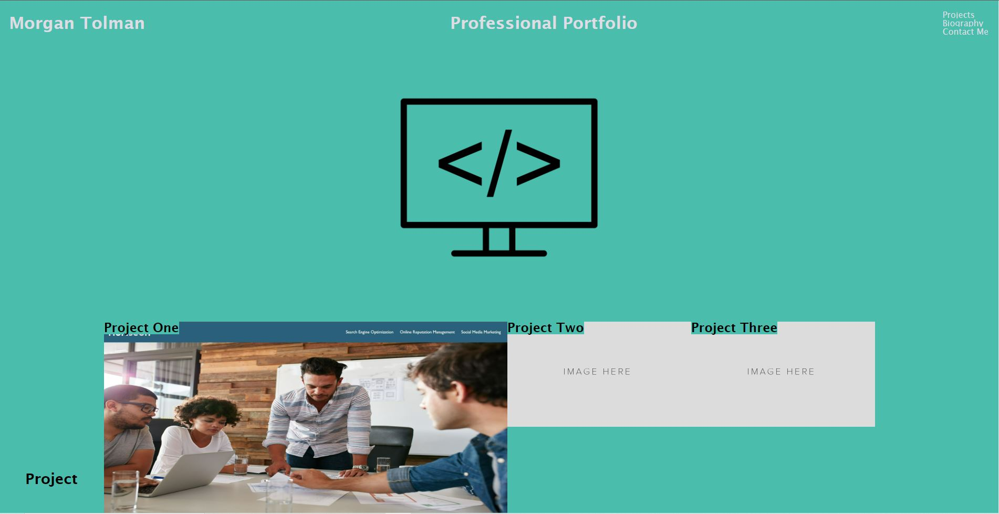

# Portfolio

## Description

I was tasked with creating a functional and professional portfolio.  I did this using both HTML and CSS.  This project was a even numbered one meaning that it contained no starter code.  That means that every line of text in the documents, excluding the reset.css, is all typed by me.

## Links

  [Live website](https://unheardof77.github.io/My-Portfolio/)
[Github repository](https://github.com/unheardof77/My-Portfolio)

## License

None

